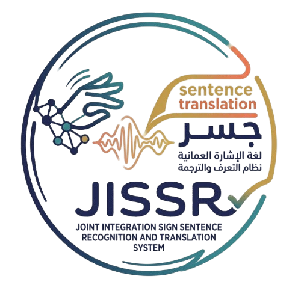
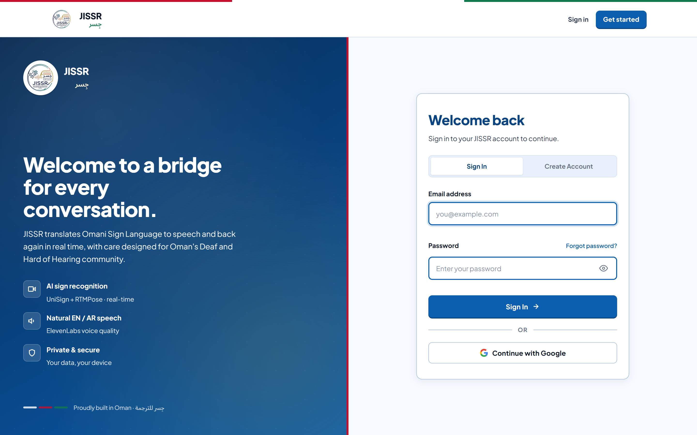
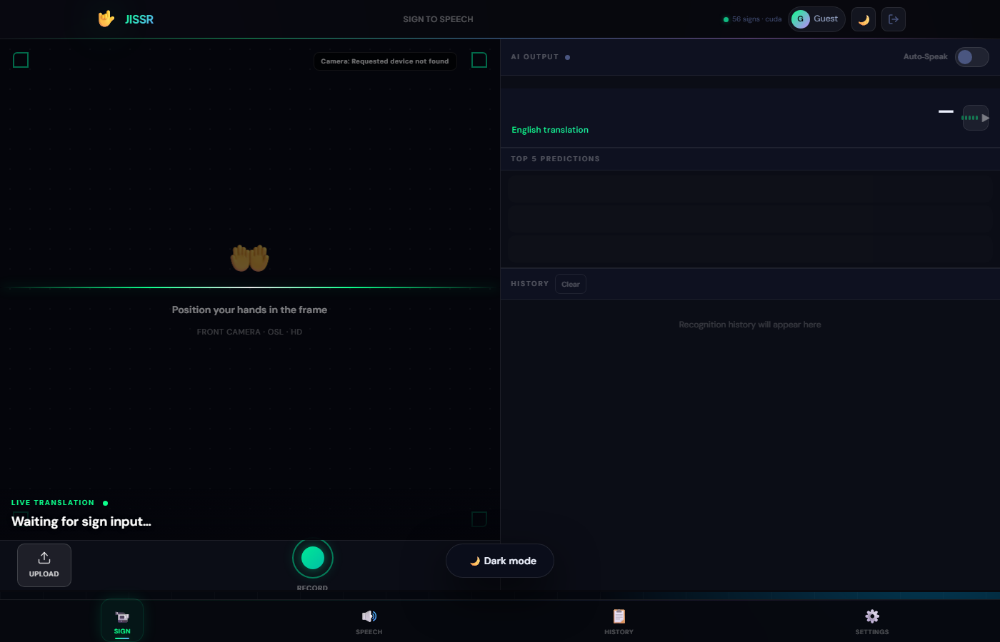

<p align="center">
  
</p>

# JISSR-OM: Omani Sign Language Translation System

**JISSR-OM** (Joint Integrated Sign Sentence Recognition and Translation System for Omani Sign Language) is a deep-learning system that translates **Omani Sign Language (OSL)** videos into text, recognizing signs at both the **word** and **sentence** level. It addresses the lack of OSL-specific tools and datasets, and is served through a real-time web application.

> Final Year Project, Sultan Qaboos University. Supervised by **Dr. Fatma Talib Al Raisi**.

---

## ✨ Highlights

- **Custom OSL dataset:** 10,356 videos from 18 signers covering **798 word signs** and **515 sentence signs**, one of the first corpora of its kind for Omani Sign Language.
- **Model:** Fine-tuned **Uni-Sign** (ICLR 2025) in PyTorch, with **RTMPose** for pose estimation.
- **Dataset-quality pipeline:** sign consistency validated with **Pearson correlation**, **Dynamic Time Warping (DTW)**, and **coefficient-of-variation (CV)** metrics.
- **Validation:** ~35% baseline dev accuracy (benchmarked against the original Uni-Sign paper) and **73% acceptance** from a certified OSL interpreter.
- **Real-time web app:** Flask + Socket.IO backend, MySQL storage, text-to-speech output.

---

## 🖥️ Interface

| Sign-in | Main translator |
|---|---|
|  |  |

---

## 🏗️ Architecture

```
Sign video / webcam ──► RTMPose (pose estimation) ──► Uni-Sign model (PyTorch)
        │                                                      │
        ▼                                                      ▼
   Flask + Socket.IO  ◄───────── word / sentence text ◄────────┘
        │
        ├─► MySQL (users, history)   ── auth, rate limiting
        └─► gTTS (text-to-speech)    ── spoken output
```

## 🛠️ Tech Stack

| Layer | Tools |
|-------|-------|
| Modeling | PyTorch, Uni-Sign, RTMPose (ONNX Runtime), transformers, sentencepiece |
| Video / vision | OpenCV, decord, Pillow, NumPy |
| Backend | Flask, Flask-SocketIO, Flask-CORS, Flask-Limiter |
| Data | MySQL (PyMySQL) |
| Speech | gTTS |
| Cloud / infra | Azure (email, storage, blob), Docker |
| Training | Kaggle T4 GPUs |

## 📂 Project structure

```
app.py               # Flask + Socket.IO web server
inference.py         # Uni-Sign inference, pose extraction, realtime processing
database.py          # MySQL access, auth, config
download_models.py   # Fetch model checkpoints
unisign/             # Model code
templates/ static/   # Web UI
data/                # Dataset-related assets
Dockerfile           # Container build
requirements.txt     # Python dependencies
```

## 🚀 Running locally

```bash
# 1. Install dependencies
pip install -r requirements.txt

# 2. Download model checkpoints
python download_models.py

# 3. Configure the MySQL connection (see database.py / config)

# 4. Start the app
python app.py
```

Or with Docker:

```bash
docker build -t jissr-om .
docker run -p 5000:5000 jissr-om
```

## 📊 Results

| Metric | Result |
|--------|--------|
| Baseline dev accuracy | ~35% (benchmarked vs. original Uni-Sign) |
| Expert validation (certified OSL interpreter) | 73% acceptance |
| Dataset | 10,356 videos · 18 signers · 798 word + 515 sentence signs |

## 📑 Deliverables

- Formal project report (incl. dataset-quality methodology, §4.2.7)
- UML diagrams: use case, sequence, and class (draw.io)
- 11-slide project presentation

## 🙏 Acknowledgements

Built on [Uni-Sign](https://github.com/ZechengLi19/Uni-Sign) (ICLR 2025) and [RTMPose](https://github.com/open-mmlab/mmpose). Supervised by Dr. Fatma Talib Al Raisi, Sultan Qaboos University.
